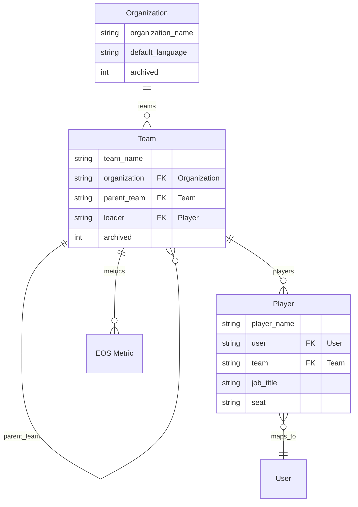
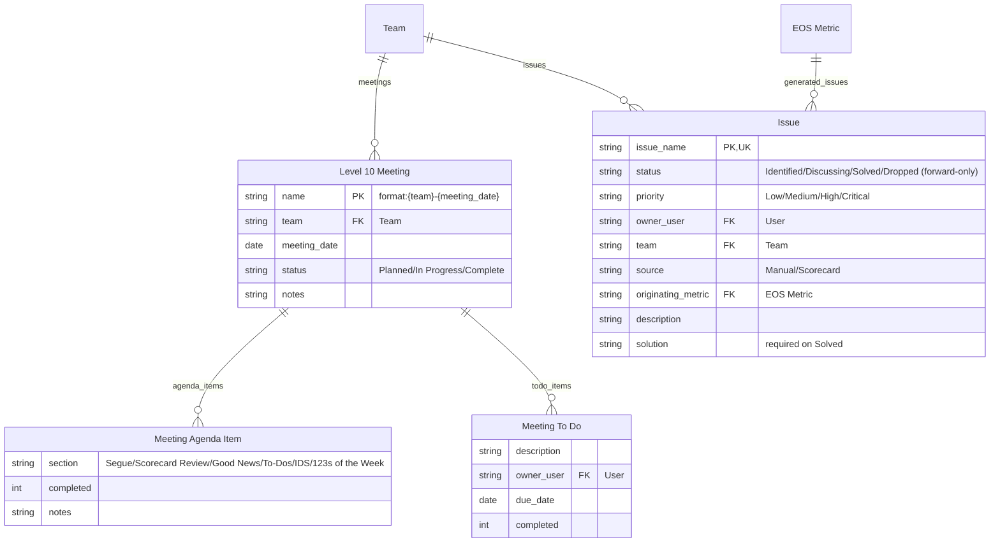
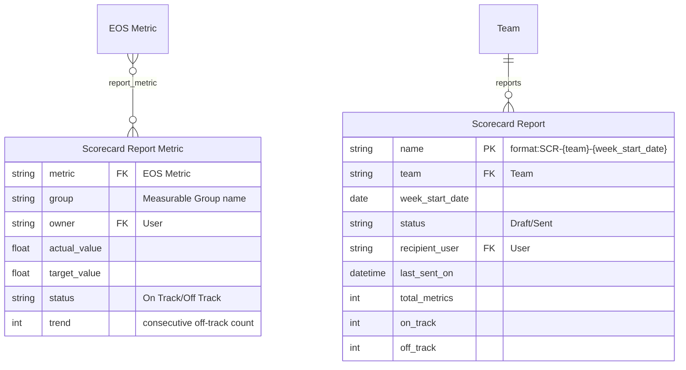

# Architecture — Eos Core (Ninety.io clone)

## 1. What we are building

**Ninety.io** is the software implementation of the **EOS (Entrepreneurial Operating System)** from
*Traction* by Gino Wickman. This app replicates its data model and workflows inside Frappe.

Ninety is built around these tools:
- **Scorecard** (the *Data Component*): teams track quantifiable **Measurables** (KPIs) against
  targets, organized into **Scorecards** (Weekly / Monthly / Quarterly / Annual) and **Groups**.
- **V/TO** (Vision/Traction Organizer): Core Focus, 10-Year Target, Marketing Strategy, 3-Year
  Picture, 1-Year Plan, Quarterly Plan, Rocks, and Issues.
- **People**: organizational structure, Accountable seats, and the People Analyzer.
- **Rocks** (90-day priorities), **To-Dos**, **Issues** (IDS workflow), and the **Level 10 Meeting**.
- **Reports**: weekly scorecard summaries, quarterly reviews.

## 2. Terminology mapping (Ninety ↔ Eos Core)

| Ninety.io | Eos Core (this app) | Notes |
|---|---|---|
| Measurable / KPI | `EOS Metric` | A quantifiable metric with a target and orientation rule |
| Score/Entry (a period's value) | `Scorecard Entry` | One record per reporting period (default weekly) |
| Scorecard (Weekly/Monthly/Quarterly/Annual) | `frequency` on `EOS Metric` | A metric belongs to exactly one timeframe; you cannot convert it later |
| Orientation rule (Greater than / Less than / Equal to / ranges) | `operator` on `EOS Metric` | `>=`, `<=`, `==`, `Inside min/max`, `Outside min/max` implemented |
| Unit type (Number/Currency/Percentage/Yes/No/Time) | `unit_type` on `EOS Metric` | Display + rollup behaviour; permanent after data entry |
| Rollup (Total/Average) | `rollup` on `EOS Metric` | How weekly values aggregate into Month/Quarter/Year views |
| Groups | `Measurable Group` (Phase 3) | Up to 20 labelled groups per Scorecard; linked from `EOS Metric.group` |
| Team / Org levels (1–5) | `Organization` / `Team` / `Player` | One `Organization`, nested `Team`s (Leadership → Department → Team), `Player`s per team |
| Status colors (green/yellow/red) | `status` + `compute_health` | `On Track` / `Off Track` stored; `Green/Yellow/Red` derived |
| Off-track 3 weeks → Issue | `count_consecutive_off_track` (Phase 3) | Right-click "Make it an Issue" workflow (Phase 4) |
| Formula Builder (Smart Measurable) | `is_smart` + `formula` on `EOS Metric` (Phase 3) | Computed measurables referencing other measurables via `{Name}` syntax (max 25 vars) |
| Scorecard (Phase 3) | `Scorecard` DocType | `team` + `timeframe` combination; auto-created when team metric saved |

## 3. Data model (Phase 1 — implemented)

```mermaid
erDiagram
    "EOS Metric" ||--o{ "Scorecard Entry" : entries

    "EOS Metric" {
        string metric_name PK, UK
        string owner FK "User"
        float target_value
        string operator ">=", "<=", "=="
        string frequency "Weekly/Monthly/Quarterly/Annual"
        string unit "display unit, e.g. '$'"
        string unit_type "Number/Currency/Percentage/Yes/No/Time"
        string rollup "Total/Average"
        int archived
        string description
    }

    "Scorecard Entry" {
        string metric FK "EOS Metric"
        date week_start_date
        float actual_value
        string status "On Track/Off Track"
    }
```

- `Scorecard Entry` is a **Child DocType** (`istable = 1`) rendered as the `entries` Table field on
  `EOS Metric`. Entries record the actual value for a specific reporting period.
- `Scorecard Entry.metric` links back to the owning `EOS Metric` and is auto-filled on save.
- Naming: `EOS Metric` is named by `metric_name` (`autoname: field:metric_name`). Child table
  records use Frappe's default hash naming.

## 3b. People & Structure (Phase 2 — implemented)



- `Organization` is the top-level root (Ninety level 1). `Team` recurses via `parent_team` to model
  the five org levels (`Organization` → Leadership → Department → Team → Individual).
- `Player` is a person in a seat; `Player.user` maps to a Frappe login (a user may hold multiple
  seats).
- **Team rules** (`Team.validate_parent_team`): rejects a parent chain that loops back to the team,
  and rejects a parent whose `Organization` differs from the child's.
- **Metric scoping rule** (`EOSMetric.validate_owner_team`): an `EOS Metric` with `team` set requires
  its `owner` (a User) to have a `Player` record in that team. Metrics without `team` are
  organization-wide and skip the rule.

## 3c. Scorecards, Groups & Formulas (Phase 3 — implemented)

```mermaid
erDiagram
    "EOS Metric" }o--|| "Scorecard" : scorecard
    "EOS Metric" }o--o| "Measurable Group" : group
    "Measurable Group" }o--|| "Scorecard" : scorecard
    "EOS Metric" ||--o{ "Scorecard Entry" : entries

    "Scorecard" {
        string name PK "format:{team}-{timeframe}"
        string team FK "Team"
        string timeframe "Weekly/Monthly/Quarterly/Annual"
        string description
        int archived
    }

    "Measurable Group" {
        string name PK (hash)
        string group_name "display name"
        string scorecard FK "Scorecard"
        int order
        string description
        int archived
    }

    "EOS Metric" {
        string metric_name PK, UK
        string scorecard FK "Scorecard (auto-created)"
        string group FK "Measurable Group"
        int is_smart "Formula Builder toggle"
        string formula "{Name} * 2 style expressions"
        float min_value "range lower bound"
        float max_value "range upper bound"
    }

    "Scorecard Entry" {
        int is_manual "skip formula recalc"
    }
```

- `Scorecard` is one per team × timeframe. Auto-created when a team-scoped metric is saved
  (`EOSMetric.ensure_scorecard`). Format autoname: `{team}-{timeframe}`.
- `Measurable Group` organizes metrics within a Scorecard (up to 20 per scorecard, unique name per
  scorecard). Not a Child DocType — Standard, so `EOS Metric.group` can link to it.
- **Range operators**: `Inside min/max` (on-track when value within bounds), `Outside min/max`
  (on-track when outside bounds). At least one of `min_value`/`max_value` required.
- **Formula Builder** (`is_smart`): metric's `actual_value` is computed from other metrics'
  entries via `{Metric Name}` syntax. Max 25 variables, same-timeframe only, no self-reference,
  no archived variables. Retroactive recalc on save skips entries with `is_manual` checked.
- **Validate order**: `validate_owner_team` → `validate_range_target` → `ensure_scorecard` →
  `validate_group` → `validate_formula` → `apply_formula` → entry status loop.

## 3d. Meetings & Issues (Phase 4 — implemented)



- **IDS workflow** (`Issue.validate_status_transition`): `Identified → Discussing → Solved | Dropped`;
  `Solved` and `Dropped` are terminal. `Solved` requires a `solution`.
- **"Make it an Issue"** (`create_issue_from_metric`): given a metric (optionally a
  `week_start_date`), takes the matching entry, rejects `On Track` entries, defaults owner to the
  team leader's User, and records `source=Scorecard` + `originating_metric` plus the consecutive
  off-track streak in the description.
- **Level 10 Meeting**: one per team × date. Format autoname `{team}-{meeting_date}`; `status`
  transitions `Planned → In Progress → Complete` are enforced. The standard 6 agenda sections are
  auto-added on insert (`default_agenda_sections`).

## 3e. Scorecard Reports (Phase 4 — implemented)



- `Scorecard Report` captures a one-time snapshot of all non-archived team + organization-wide
  metrics for a given week. Format autoname `SCR-{team}-{week_start_date}`.
- `populate_snapshot()` runs on insert: collects metrics, builds per-metric blocks (entries +
  statuses), calls `build_scorecard_report` to compute summary + trend detection, stores in the
  child table.
- `send_report()` renders `templates/emails/weekly_scorecard_report.html` and sends to the team
  leader (or the configured `recipient_user`). Sets `status=Sent` and timestamps.

## 3f. EOS Operating System tools (Phase 5 — implemented)


- **V/TO** (`VTO`): one per `Organization` (enforced in `validate`). On insert, the five child
  sections are auto-populated as a single empty row each (`populate_sections`) — the user edits
  them in place. Children are passive (`istable=1`).
- **Rocks** (`Rock`): 90-day priority with `status`, `scope` (Company/Team/Individual), an
  optional `team`, duration window, and head-down hours. `Rock Milestone` child rows gate
  completion: a Rock cannot be `Complete` while a milestone is open, and `mark_complete` rejects
  open milestones, completes the Rock, and cascades `Complete` to linked active To-Dos.
- **To-Dos** (`To Do`): forward-only `status` transitions (`Not Started → In Progress →
  Complete/Dropped`); no-op saves (same status) are allowed. `cascade_todo_transitions` bulk-closes
  a list of To-Dos (used by `mark_complete`). `To Do Item` is a passive child checklist.
- **Quarterly Review** (`Quarterly Review`): one per team × `period_start` (uniqueness matches the
  autoname key). `populate_snapshot` on insert runs `build_quarterly_review` against:
  - Rocks that are `Company`-scoped **or** belong to the review team, with a duration window
    overlapping `[period_start, period_end]`;
  - To-Dos whose `due_date` falls inside `[period_start, period_end]`;
  - the latest `Scorecard Entry` inside the period for each non-archived metric of the team (or
    org-wide).
  Overdue is judged against `period_end` (passed as `as_of`), not the current date, so historical
  reviews are stable.

## 4. Scoring engine (`eos_core/scorecard_engine.py`)

Pure, frappe-free functions so they are trivially testable. Behaviour (defaults, all configurable):

| Function | Signature | Behaviour |
|---|---|---|
| `compute_status` | `(target_value, actual_value, operator, min_value=None, max_value=None)` | `On Track`/`Off Track`. Ranges: Inside = on-track within bounds; Outside = on-track outside bounds. `>=`: actual ≥ target. `<=`: actual ≤ target. `==`: exact equality. Missing actual → `None`. Missing target → `On Track`. |
| `compute_achievement` | `(target_value, actual_value, operator, min_value=None, max_value=None)` | Percent of goal, clamped 0–100. Ranges: Inside = 100 in-range, else ratio to boundary. Outside = 100 outside, else distance-to-edge. |
| `compute_health` | `(target_value, actual_value, operator, tolerance=0.1, min_value=None, max_value=None)` | Ninety-style colour: `Green` (on target), `Yellow` (within `tolerance` of target), `Red` (off). |
| `aggregate_values` | `(values, rollup)` | `Total` = sum, `Average` = mean of numeric values; skips `None`. |
| `extract_variables` | `(formula)` | Parses `{Name}` references from a formula string. Returns sorted list of names. |
| `evaluate_formula` | `(formula, variables)` | Safe AST-based evaluator. `{Name}` vars replaced with floats, div-by-zero → `None`. Max 25 vars. |
| `prorate_for_period` | `(value, covered_days, period_days)` | Prorates a value by coverage ratio, clamped 0–1. |
| `count_consecutive_off_track` | `(statuses)` | Returns trailing count of consecutive `Off Track` entries from the end of the list. |
| `scorecard_summary` | `(statuses)` | Returns `{total, on_track, off_track}` counts for a list of entry statuses. |
| `default_agenda_sections` | `()` | The six standard Level 10 agenda sections in order. |
| `build_scorecard_report` | `(metric_blocks, trend_threshold=3)` | From a list of metric dicts (with `statuses`), computes per-metric trend, overall summary, and metrics exceeding the consecutive off-track threshold. |
| `quarter_bounds` | `(anchor)` | Returns `(period_start, period_end)` for the quarter containing `anchor`. |
| `rollup_rock_summary` | `(rock_rows, )` | `{total, active, complete, average_progress}` given rows with `status`/`progress`. |
| `rollup_todo_summary` | `(todo_rows, as_of=None)` | `{total, open, complete, overdue}` given rows with `status`/`due_date`; open todos due before `as_of` (default: today) count overdue. |
| `build_quarterly_review` | `(rock_rows, todo_rows, measurable_rows, as_of=None)` | Combines the three rollups into `{rocks, todos, measurables}` for a review snapshot. |

Design notes:
- Status is **computed once per period**, never cumulative/vs YTD (matches Ninety: each reporting
  period is judged against the per-period target).
- `==` on floats is exact; a tolerance variant is a documented enhancement.
- Validate logic lives in `EOSMetric.validate`; it recomputes every child entry's `status` whenever
  the parent (or grid) is saved.

## 5. Module layout

```
eos_core/
├── scorecard_engine.py          # pure logic (status, achievement, health, aggregation, formulas)
└── eos_core/                    # "Eos Core" module (per modules.txt)
    └── doctype/
        ├── eos_metric/          # controller: validation + formula recalc
        ├── scorecard_entry/     # controller: passive (pass)
        ├── scorecard/           # controller: unique team+timeframe
        ├── measurable_group/    # controller: 20-group cap + unique name per scorecard
        ├── issue/               # controller: IDS transitions; create_issue_from_metric
        ├── level_10_meeting/    # controller: unique team+date, agenda auto-fill, transitions
        ├── meeting_agenda_item/ # child: L10 agenda row (passive)
        ├── meeting_to_do/       # child: L10 action item (passive)
        ├── scorecard_report/    # controller: snapshot generation, send_report (email)
        ├── scorecard_report_metric/ # child: report snapshot row (passive)
        ├── organization/        # organization root
        ├── team/                # nested hierarchy with cycle/cross-org validation
        ├── player/              # person/seat mapped to Frappe User
        ├── vto/                 # V/TO header (one per org) + populate_sections
        ├── vto_core_focus/      # child: purpose / niche / 10-year target (passive)
        ├── vto_marketing_strategy/ # child: threes / uniques / process / guarantee (passive)
        ├── vto_3_year_picture/  # child: 3-year targets + vivid description (passive)
        ├── vto_1_year_plan/     # child: 1-year targets + goals (passive)
        ├── vto_quarterly_rocks/ # child: quarter_date + rocks text (passive)
        ├── rock/                # controller: status/milestone gating, mark_complete cascade
        ├── rock_milestone/      # child: milestone rows gating Rock completion (passive)
        ├── to_do/               # controller: forward-only status, cascade_todo_transitions
        ├── to_do_item/          # child: passive checklist rows
        └── quarterly_review/    # controller: team×period snapshot via build_quarterly_review
```

Keep this rule: **pure math in `scorecard_engine.py`, frappe glue in controllers.**

## 6. Planned evolution (full map)

See `docs/roadmap.md` for status. The target model adds:

- **Structure (Phase 2 — DONE)**: `Organization` → `Team` (nested) → `Player`; metrics scoped via
  `EOS Metric.team` with an owner-in-team rule.
- **Scorecard/groups (Phase 3 — DONE)**: `Scorecard` header (per team × timeframe), `Measurable Group`,
  Formula Builder (Smart Measurables), `prorate_for_period`, `count_consecutive_off_track`.
  Forecasting/custom period goals are deferred.
- **Meetings & Issues (Phase 4 — DONE)**: `Level 10 Meeting` (agenda + to-dos), `Issue` IDS
  workflow with "Make it an Issue" from off-track measurables, weekly `Scorecard Report`
  with snapshot, email sending, and trend detection.
- **EOS tools (Phase 5 — DONE)**: `VTO` with five child sections (Core Focus / Marketing Strategy /
  3-Year Picture / 1-Year Plan / Quarterly Rocks), `Rock` + `Rock Milestone`, `To Do` + `To Do Item`,
  and `Quarterly Review` team snapshots.
- **Permissions (Phase 6)**: map Ninety roles (Owner / Admin / Coach / Manager / Team Member /
  Observer) onto Frappe roles and DocPerm blocks.

## 7. Known deviations / decisions

- The Phase 1 spec named `operator` with `>=`/`<=`/`==` as the orientation rule; Ninety's range
  rules (`Inside min/max`, `Outside min/max`) are deferred to a schema revision in Phase 3.
- `frequency` already lists Quarterly/Annual (Ninety ships 4 scorecards per team) even though entry
  UI defaults to weekly.
- UI/Single-page Scorecard board, bulk paste, trends view, and PDF export are out of scope for the
  backend-first milestones; they are Phase 3+ frontend/Web Page work.