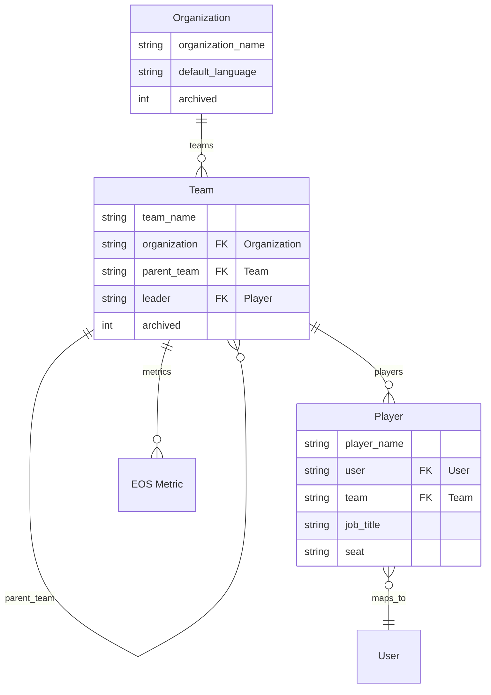
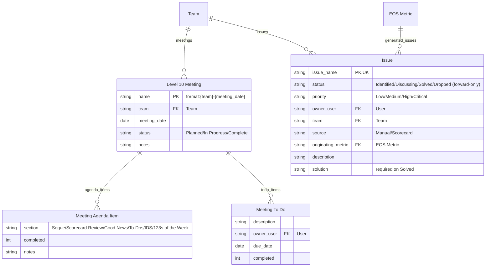
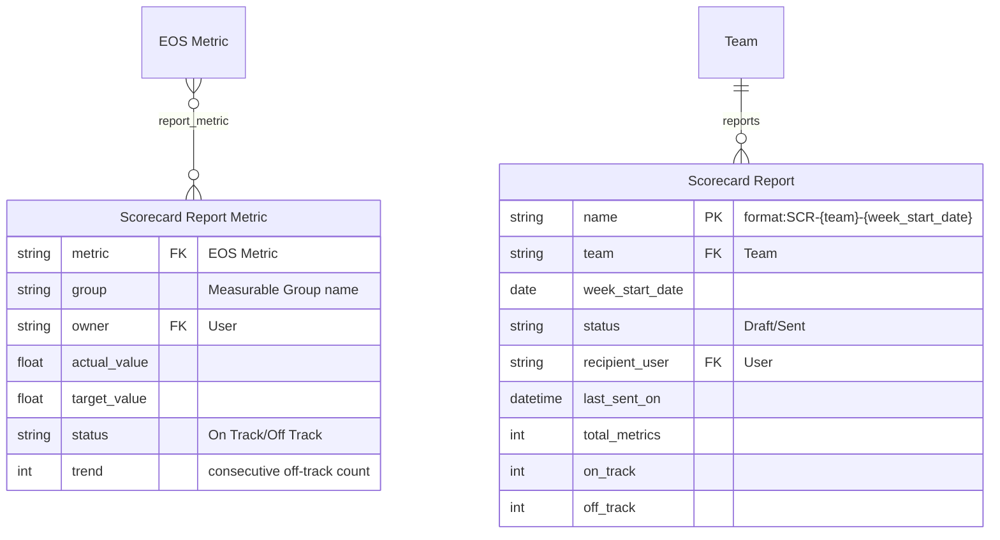
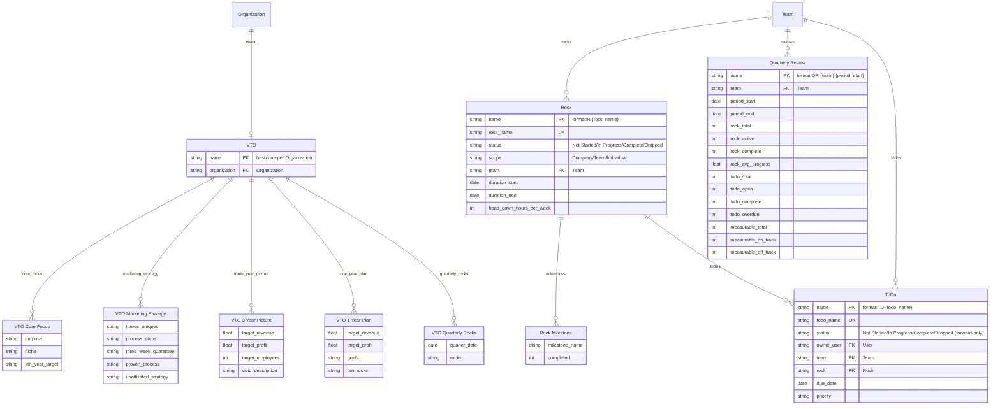

# Architecture — Eos Core (Ninety.io clone)

## 1. What we are building

**Ninety.io** is the software implementation of the **EOS (Entrepreneurial Operating System)** from
*Traction* by Gino Wickman. This app replicates its data model and workflows inside Frappe.

Ninety is built around these tools:
- **Scorecard** (the *Data Component*): teams track quantifiable **Measurables** (KPIs) against
  targets, organized into **Scorecards** (Weekly / Monthly / Quarterly / Annual) and **Groups**.
- **V/TO** (Vision/Traction Organizer): Core Focus, 10-Year Target, Marketing Strategy, 3-Year
  Picture, 1-Year Plan, Quarterly Plan, Rocks, and Issues.
- **People**: organizational structure, Accountable seats, and the People Analyzer.
- **Rocks** (90-day priorities), **To-Dos**, **Issues** (IDS workflow), and the **Level 10 Meeting**.
- **Reports**: weekly scorecard summaries, quarterly reviews.

## 2. Terminology mapping (Ninety ↔ Eos Core)

| Ninety.io | Eos Core (this app) | Notes |
|---|---|---|
| Measurable / KPI | `EOS Metric` | A quantifiable metric with a target and orientation rule |
| Score/Entry (a period's value) | `Scorecard Entry` | One record per reporting period (default weekly) |
| Scorecard (Weekly/Monthly/Quarterly/Annual) | `frequency` on `EOS Metric` | A metric belongs to exactly one timeframe; you cannot convert it later |
| Orientation rule (Greater than / Less than / Equal to / ranges) | `operator` on `EOS Metric` | `>=`, `<=`, `==`, `Inside min/max`, `Outside min/max` implemented |
| Unit type (Number/Currency/Percentage/Yes/No/Time) | `unit_type` on `EOS Metric` | Display + rollup behaviour; permanent after data entry |
| Rollup (Total/Average) | `rollup` on `EOS Metric` | Ninety's "Show rollup data as" option, default `Total`. Governs how weekly values aggregate into Month/Quarter/Year "View by" views — read by `aggregate_entries_for_period` via `Scorecard.get_rollup_view` (Block 2b). |
| Groups | `Measurable Group` (Phase 3) | Up to 20 labelled groups per Scorecard; linked from `EOS Metric.group`. `order` is read by `sort_metrics_by_group`, which orders the `Scorecard Report` snapshot and the L10 "Scorecard Review" agenda (Block 2c); ungrouped measurables sort last. |
| Team / Org levels (1–5) | `Organization` / `Team` / `Player` | One `Organization`, nested `Team`s (Leadership → Department → Team), `Player`s per team |
| Status colors (green/yellow/red) | **implemented (Block 2a)** | Ninety derives the indicator from the 3 most recently **completed** reporting intervals: Green = on target for all 3, Yellow = missed at least one, Red = missed all 3, plus "No Recent Data" when none of the 3 are scored. The current in-progress period is excluded. `compute_status_indicator` + `completed_period_statuses` implement this, and `Scorecard Report Metric.status_indicator` persists it per metric. The non-Ninety 10%-tolerance `compute_health` was deleted. Empty intervals **count against** the indicator (Ninety: "empty periods count against the calculation"), so a scored history with gaps can read `Yellow` or `Red` but never `Green`. |
| Off-track 3 weeks → Issue | `count_consecutive_off_track` (Phase 3) | Right-click "Make it an Issue" workflow (Phase 4) |
| Formula Builder (Smart Measurable) | `is_smart` + `formula` on `EOS Metric` (Phase 3) | Computed measurables referencing other measurables via `{Name}` syntax (max 25 vars) |
| Scorecard (Phase 3) | `Scorecard` DocType | `team` + `timeframe` combination; auto-created when team metric saved |

## 3. Data model (Phase 1 — implemented)

```mermaid
erDiagram
    "EOS Metric" ||--o{ "Scorecard Entry" : entries

    "EOS Metric" {
        string metric_name PK, UK
        string owner FK "User"
        float target_value
        string operator ">=", "<=", "=="
        string frequency "Weekly/Monthly/Quarterly/Annual"
        string unit "display unit, e.g. '$'"
        string unit_type "Number/Currency/Percentage/Yes/No/Time"
        string rollup "Total/Average"
        int archived
        string description
    }

    "Scorecard Entry" {
        string metric FK "EOS Metric"
        date week_start_date
        float actual_value
        string status "On Track/Off Track"
    }
```

- `Scorecard Entry` is a **Child DocType** (`istable = 1`) rendered as the `entries` Table field on
  `EOS Metric`. Entries record the actual value for a specific reporting period.
- `Scorecard Entry.metric` links back to the owning `EOS Metric` and is auto-filled on save.
- Naming: `EOS Metric` is named by `metric_name` (`autoname: field:metric_name`). Child table
  records use Frappe's default hash naming.

## 3b. People & Structure (Phase 2 — implemented)



- `Organization` is the top-level root (Ninety level 1). `Team` recurses via `parent_team` to model
  the five org levels (`Organization` → Leadership → Department → Team → Individual).
- `Player` is a person in a seat; `Player.user` maps to a Frappe login.
- **Seats and team ownership** (`DATA-1` decision, 2026-09-28). `Player.user` is deliberately **not**
  unique. Ninety states plainly that "Many Ninety users are members of multiple teams", invites users
  with a **Team(s)** dropdown, and resolves ownership by Seat where a user holds several. Making
  `user` unique would break that parity, so it stays unindexed by design.
  - **Which team owns a multi-team user?** The metric's own `team` field disambiguates. Ownership is
    always the pair `(user, team)` — never `user` alone — which is what
    `EOSMetric.validate_owner_team` already queries, so no lookup in the app is ambiguous. Every
    other consumer resolves a `Player` by its own `name` (via `Team.leader`), not by user.
  - **What is enforced** is one seat per person *per team*: `Player.validate_unique_seat_in_team`
    rejects a second `Player` for the same `(user, team)`. Without it, a team could hold two
    `Player` rows for one login and the Seat that owns a measurable would be unresolvable.
  - A `Player` with no `team` is permitted (an unassigned seat) but owns no team-scoped measurable,
    so it cannot satisfy `validate_owner_team` for any team.
  - Known deviation: Ninety lets one person sit in **multiple Seats**; this model allows one seat per
    team instead. Recorded rather than silently narrowed — revisit if a Seat-level question needs to
    be answerable.
- **Team rules** (`Team.validate_parent_team`): rejects a parent chain that loops back to the team,
  and rejects a parent whose `Organization` differs from the child's.
- **Metric scoping rule** (`EOSMetric.validate_owner_team`): an `EOS Metric` with `team` set requires
  its `owner` (a User) to have a `Player` record in that team. Metrics without `team` are
  organization-wide and skip the rule.

## 3c. Scorecards, Groups & Formulas (Phase 3 — implemented)

```mermaid
erDiagram
    "EOS Metric" }o--|| "Scorecard" : scorecard
    "EOS Metric" }o--o| "Measurable Group" : group
    "Measurable Group" }o--|| "Scorecard" : scorecard
    "EOS Metric" ||--o{ "Scorecard Entry" : entries

    "Scorecard" {
        string name PK "format:{team}-{timeframe}"
        string team FK "Team"
        string timeframe "Weekly/Monthly/Quarterly/Annual"
        string description
        int archived
    }

    "Measurable Group" {
        string name PK (hash)
        string group_name "display name"
        string scorecard FK "Scorecard"
        int order
        string description
        int archived
    }

    "EOS Metric" {
        string metric_name PK, UK
        string scorecard FK "Scorecard (auto-created)"
        string group FK "Measurable Group"
        int is_smart "Formula Builder toggle"
        string formula "{Name} * 2 style expressions"
        float min_value "range lower bound"
        float max_value "range upper bound"
    }

    "Scorecard Entry" {
        int is_manual "skip formula recalc"
    }
```

- `Scorecard` is one per team × timeframe. Auto-created when a team-scoped metric is saved
  (`EOSMetric.ensure_scorecard`). Format autoname: `{team}-{timeframe}`.
- `Measurable Group` organizes metrics within a Scorecard (up to 20 per scorecard, unique name per
  scorecard). Not a Child DocType — Standard, so `EOS Metric.group` can link to it.
- **Range operators**: `Inside min/max` (on-track when value within bounds), `Outside min/max`
  (on-track when outside bounds). At least one of `min_value`/`max_value` required.
- **Formula Builder** (`is_smart`): metric's `actual_value` is computed from other metrics'
  entries via `{Metric Name}` syntax. Max 25 variables, same-timeframe only, no self-reference,
  no archived variables. Retroactive recalc on save skips entries with `is_manual` checked.
- **Validate order**: `validate_owner_team` → `validate_range_target` → `ensure_scorecard` →
  `validate_group` → `validate_formula` → `apply_formula` → entry status loop.

## 3d. Meetings & Issues (Phase 4 — implemented)



- **IDS workflow** (`Issue.validate_status_transition`): `Identified → Discussing → Solved | Dropped`;
  `Solved` and `Dropped` are terminal. `Solved` requires a `solution`.
- **"Make it an Issue"** (`create_issue_from_metric`): given a metric (optionally a
  `week_start_date`), takes the matching entry, rejects `On Track` entries, defaults owner to the
  team leader's User, and records `source=Scorecard` + `originating_metric` plus the consecutive
  off-track streak in the description. The streak is **bounded at the entry's own week**:
  `count_consecutive_from_db(metric_name, as_of=None)` caps its query with `week_start_date <= as_of`,
  so an Issue raised about an older week reports the run ending at that week rather than one running
  through the most recent week. With no `as_of` it is the current streak.
- **Level 10 Meeting**: one per team × date. Format autoname `{team}-{meeting_date}`; `status`
  transitions `Planned → In Progress → Complete` are enforced. The standard 6 agenda sections are
  auto-added on insert (`default_agenda_sections`).

## 3e. Scorecard Reports (Phase 4 — implemented)



- `Scorecard Report` captures a one-time snapshot of all non-archived team + organization-wide
  metrics for a given week. Format autoname `SCR-{team}-{week_start_date}`.
- `populate_snapshot()` runs on insert: collects metrics, builds per-metric blocks (entries +
  statuses), calls `build_scorecard_report` to compute summary + trend detection, stores in the
  child table.
- `send_report()` renders `templates/emails/weekly_scorecard_report.html` and sends to the team
  leader (or the configured `recipient_user`). Sets `status=Sent` and timestamps. The template is
  rendered with `_email_context()`, which supplies exactly four keys: `report` (`team`,
  `week_start_date`, `generated_on`), `summary` (`total`, `on_track`, `off_track`), `trends` (one
  `{name, consecutive_off_track}` per child row) and `rows` (one per child row, exposing
  `name`/`group`/`owner`/`actual`/`target`/`status`/`trend` plus `status_indicator`). A change to the
  child table or to that context needs a matching template update or the email renders stale data.
- `populate_snapshot` computes `trends` twice: `build_scorecard_report` returns a `trends` list that
  is then **discarded**, and the value is recomputed from the child rows instead. The engine's
  result is dead work today.
- Rows are ordered by `Measurable Group.order` (ungrouped last) via `sort_metrics_by_group`, which
  is Ninety's "the groups appear in the same order you've set on the Scorecard".
- The snapshot deliberately does **not** include a rolled-up aggregate. See §3g.

## 3g. "View by" rolled-up view (Block 2b — implemented)

Ninety's Scorecard has a **View by** dropdown: `Week` (default) or the read-only `Month`,
`Quarter` and `Year`, which "display prorated data aggregated by calendar" period. Two Ninety rules
govern it and both are implemented:

1. **Weeks that straddle a boundary are split by calendar day, not by whole week.** Ninety's own
   example: a week running Oct 27 – Nov 2 contributes **5/7 to October and 2/7 to November**.
   `week_overlap_days` / `aggregate_entries_for_period` do this per entry.
2. **The aggregate is display-only.** Ninety: *"the data columns aggregate your weekly entries —
   but the Goal and Average columns continue to display the single-period (weekly) value. This is
   intentional."* and *"the Total and Average columns do not affect a period's on-track status."*

Consequences, all enforced by tests:

- `Scorecard.get_rollup_view(view_by, range_start, range_end)` is a `@frappe.whitelist()`
  **read-only** endpoint. It returns `read_only: True`, the period columns, and per metric the
  prorated value per period plus the **unchanged weekly `goal`**. It carries **no** `status`,
  `status_indicator` or `trend` key, so a rolled-up view cannot alter a scorecard's on-track state.
- **No new DocType.** Ninety is explicit that View by "does not convert Weekly Measurables into
  Monthly, Quarterly, or Annual Measurables: those remain separate Scorecards", so the rollup is a
  projection over the existing `Scorecard` (one per `team` × `timeframe`) and nothing is persisted.
- Only the `Weekly` Scorecard can be rolled up — it is the source of the weekly entries. `view_by`
  accepts either vocabulary (`Month` or `Monthly`) via `normalise_view_by`; `Week` and unknown
  values are rejected.
- `EOS Metric.rollup` (`Total`, Ninety's default, or `Average`) selects the aggregation. Ninety
  advises percentage-target measurables use `Average`.
- The default range is the most recent 13 weeks, matching Ninety's default Date range. Period labels
  are Ninety's headers (`October 2026`, `Q4 2026`, `2026`).
- There is still **no UI** for this: the endpoint is the only way to read it.

## 3f. EOS Operating System tools (Phase 5 — implemented)



- **V/TO** (`VTO`): one per `Organization` (enforced in `validate`). On insert, the five child
  sections are auto-populated as a single empty row each (`populate_sections`) — the user edits
  them in place. Children are passive (`istable=1`).
- **Rocks** (`Rock`): 90-day priority with `status`, `scope` (Company/Team/Individual), an
  optional `team`, duration window, and head-down hours. `Rock Milestone` child rows gate
  completion: a Rock cannot be `Complete` while a milestone is open, and `mark_complete` rejects
  open milestones, completes the Rock, and cascades `Complete` to linked active To-Dos.
- **To-Dos** (`To Do`): forward-only `status` transitions (`Not Started → In Progress →
  Complete/Dropped`); no-op saves (same status) are allowed. `cascade_todo_transitions` bulk-closes
  a list of To-Dos (used by `mark_complete`). `To Do Item` is a passive child checklist.
- **Quarterly Review** (`Quarterly Review`): one per team × `period_start` (uniqueness matches the
  autoname key). `populate_snapshot` on insert runs `build_quarterly_review` against:
  - Rocks that are `Company`-scoped **or** belong to the review team, with a duration window
    overlapping `[period_start, period_end]`;
  - To-Dos whose `due_date` falls inside `[period_start, period_end]`;
  - the latest `Scorecard Entry` inside the period for each non-archived metric of the team (or
    org-wide).
  Overdue is judged against `period_end` (passed as `as_of`), not the current date, so historical
  reviews are stable.

## 4. Scoring engine (`eos_core/scorecard_engine.py`)

Pure, frappe-free functions so they are trivially testable. Behaviour (defaults, all configurable):

| Function | Signature | Behaviour |
|---|---|---|
| `compute_status` | `(target_value, actual_value, operator, min_value=None, max_value=None)` | `On Track`/`Off Track`. Ranges: Inside = on-track within bounds; Outside = on-track outside bounds. `>=`: actual ≥ target. `<=`: actual ≤ target. `==`: exact equality. Missing actual → `None`. Missing target → `On Track`. |
| `compute_achievement` | `(target_value, actual_value, operator, min_value=None, max_value=None)` | Percent of goal, clamped 0–100. Ranges: Inside = 100 in-range, else ratio to boundary. Outside = 100 outside, else distance-to-edge. |
| `compute_status_indicator` | `(statuses, window=3)` | Ninety's status indicator over the last `window` completed reporting intervals. All `On Track` → `Green`; none `On Track` → `Red`; mixed → `Yellow`; no scored interval at all → `No Recent Data`. Unscored (`None`) intervals **count against** the result, so a gap can never read `Green`. |
| `is_period_complete` | `(period_start, today=None)` | `True` once all 7 days of a weekly period have elapsed (`period_start + 6 days < today`). Accepts `date`, `datetime` or ISO string. The current in-progress week is therefore never complete. |
| `recent_completed_period_starts` | `(today=None, window=3)` | The `window` most recently completed Monday-aligned week starts before `today`, oldest → newest. Delegates to `is_period_complete` so "period complete" has one definition. |
| `completed_period_statuses` | `(entries, today=None, window=3)` | Exactly `window` statuses, one per completed interval from `recent_completed_period_starts`, oldest → newest. An interval with no entry yields `None`, so empty periods count against the indicator. `entries` need `week_start_date` and `status`; undated entries are ignored. |
| `aggregate_values` | `(values, rollup)` | `Total` = sum, `Average` = mean of numeric values; skips `None`. |
| `extract_variables` | `(formula)` | Parses `{Name}` references from a formula string. Returns sorted list of names. |
| `evaluate_formula` | `(formula, variables)` | Safe AST-based evaluator. `{Name}` vars replaced with floats, div-by-zero → `None`. Max 25 vars. |
| `validate_formula_syntax` | `(formula)` | Boolean syntax/safety check used by `EOSMetric.validate_formula`. Substitutes `0.0` for every `{Name}` variable, rejects leftover braces or any character outside the safe class, and requires `ast.parse` to succeed. It deliberately does **not** evaluate, so a valid formula such as `{A}/(1-{B})` is not rejected for dividing by zero. |
| `prorate_for_period` | `(value, elapsed, total)` | Returns `value * elapsed / total` with the ratio clamped to 0–1. Negative `elapsed`, non-positive `total` and zero `elapsed` all return `None` rather than a negative or infinite value. |
| `week_overlap_days` | `(week_start, period_start, period_end)` | Calendar days the 7-day week beginning `week_start` shares with the inclusive period, 0–7. Ninety splits straddling weeks by day: a week of Oct 27 – Nov 2 gives `5` against October and `2` against November. |
| `week_overlap_ratio` | `(week_start, period_start, period_end)` | `week_overlap_days / 7`, so 0–1. Public expression of Ninety's split ratio; `aggregate_entries_for_period` uses the day form. |
| `aggregate_entries_for_period` | `(entries, period_start, period_end, rollup)` | Prorates every weekly entry by its `week_overlap_days` share of the period, then `aggregate_values` per `rollup` (`Total`/`Average`). Entries with no `actual_value` are skipped; `None` when nothing contributes. |
| `normalise_view_by` | `(view_by)` | Maps a `Scorecard.timeframe` value to Ninety's View by vocabulary (`Weekly`→`Week`, `Monthly`→`Month`, `Quarterly`→`Quarter`, `Annual`→`Year`); returns `None` for anything else. |
| `period_bounds` | `(anchor, view_by)` | `(start, end)` of the week / calendar month / calendar quarter / calendar year containing `anchor`. `None` for an unknown view or missing anchor. |
| `advance_period` | `(period_start, view_by)` | The start of the next period, rolling over months, quarters and years. |
| `period_label` | `(period_start, view_by)` | Ninety's column header text: ISO date for `Week`, `October 2026`, `Q4 2026`, `2026`. |
| `rollup_periods` | `(view_by, range_start, range_end)` | Every period of `view_by` touched by the inclusive range, as `{view_by, label, period_start, period_end}` with ISO dates. `[]` for an unknown view or missing bound. |
| `sort_metrics_by_group` | `(metrics, group_orders)` | Sorts metric dicts by `Measurable Group.order` using `group_key` (falling back to `group`), stable within a group. Metrics with no group sort **last**. Unknown groups are treated as order 0. |
| `build_scorecard_review_lines` | `(metrics, group_orders=None)` | Group-ordered agenda text: a group header per group (`Ungrouped` for the ungrouped block) then `  Name (Indicator)`, omitting the indicator when there is none. Used to pre-fill the L10 "Scorecard Review" agenda item. |
| `count_consecutive_off_track` | `(statuses)` | Returns trailing count of consecutive `Off Track` entries from the end of the list. |
| `scorecard_summary` | `(statuses)` | Returns `{total, on_track, off_track}` counts for a list of entry statuses. |
| `default_agenda_sections` | `()` | The six standard Level 10 agenda sections in order. |
| `build_scorecard_report` | `(metric_blocks, trend_threshold=3)` | From a list of metric dicts (with `statuses`), computes per-metric trend, overall summary, and metrics exceeding the consecutive off-track threshold. |
| `quarter_bounds` | `(anchor)` | Returns `(period_start, period_end)` for the quarter containing `anchor`. |
| `rollup_rock_summary` | `(rock_rows)` | `{total, active, complete, average_progress}` given rows with `status`/`progress`. |
| `rollup_todo_summary` | `(todo_rows, as_of=None)` | `{total, open, complete, overdue}` given rows with `status`/`due_date`; open todos due before `as_of` (default: today) count overdue. |
| `build_quarterly_review` | `(rock_rows, todo_rows, measurable_rows, as_of=None)` | Combines the three rollups into `{rocks, todos, measurables}` for a review snapshot. |

Design notes:
- Status is **computed once per period**, never cumulative/vs YTD (matches Ninety: each reporting
  period is judged against the per-period target).
- `==` on floats is exact; a tolerance variant is a documented enhancement.
- Validate logic lives in `EOSMetric.validate`; it recomputes every child entry's `status` whenever
  the parent (or grid) is saved.

## 5. Module layout

```
eos_core/
├── scorecard_engine.py          # pure logic (status, achievement, health, aggregation, formulas)
└── eos_core/                    # "Eos Core" module (per modules.txt)
    └── doctype/
        ├── eos_metric/          # controller: validation + formula recalc
        ├── scorecard_entry/     # controller: passive (pass)
        ├── scorecard/           # controller: unique team+timeframe
        ├── measurable_group/    # controller: 20-group cap + unique name per scorecard
        ├── issue/               # controller: IDS transitions; create_issue_from_metric
        ├── level_10_meeting/    # controller: unique team+date, agenda auto-fill, transitions
        ├── meeting_agenda_item/ # child: L10 agenda row (passive)
        ├── meeting_to_do/       # child: L10 action item (passive)
        ├── scorecard_report/    # controller: snapshot generation, send_report (email)
        ├── scorecard_report_metric/ # child: report snapshot row (passive)
        ├── organization/        # organization root
        ├── team/                # nested hierarchy with cycle/cross-org validation
        ├── player/              # person/seat mapped to Frappe User
        ├── vto/                 # V/TO header (one per org) + populate_sections
        ├── vto_core_focus/      # child: purpose / niche / 10-year target (passive)
        ├── vto_marketing_strategy/ # child: threes / uniques / process / guarantee (passive)
        ├── vto_3_year_picture/  # child: 3-year targets + vivid description (passive)
        ├── vto_1_year_plan/     # child: 1-year targets + goals (passive)
        ├── vto_quarterly_rocks/ # child: quarter_date + rocks text (passive)
        ├── rock/                # controller: status/milestone gating, mark_complete cascade
        ├── rock_milestone/      # child: milestone rows gating Rock completion (passive)
        ├── to_do/               # controller: forward-only status, cascade_todo_transitions
        ├── to_do_item/          # child: passive checklist rows
        └── quarterly_review/    # controller: team×period snapshot via build_quarterly_review
```

Keep this rule: **pure math in `scorecard_engine.py`, frappe glue in controllers.**

## 6. Planned evolution (full map)

Phase status is in `docs/roadmap.md`; the live work queue with stable IDs is in
[`TODO.md`](TODO.md). The target model adds:

- **Structure (Phase 2 — DONE)**: `Organization` → `Team` (nested) → `Player`; metrics scoped via
  `EOS Metric.team` with an owner-in-team rule.
- **Scorecard/groups (Phase 3 — DONE)**: `Scorecard` header (per team × timeframe), `Measurable Group`,
  Formula Builder (Smart Measurables), `prorate_for_period`, `count_consecutive_off_track`.
  Forecasting/custom period goals are deferred.
- **Meetings & Issues (Phase 4 — DONE)**: `Level 10 Meeting` (agenda + to-dos), `Issue` IDS
  workflow with "Make it an Issue" from off-track measurables, weekly `Scorecard Report`
  with snapshot, email sending, and trend detection.
- **EOS tools (Phase 5 — DONE)**: `VTO` with five child sections (Core Focus / Marketing Strategy /
  3-Year Picture / 1-Year Plan / Quarterly Rocks), `Rock` + `Rock Milestone`, `To Do` + `To Do Item`,
  and `Quarterly Review` team snapshots.
- **Permissions (Phase 6)**: map Ninety roles (Owner / Admin / Coach / Manager / Team Member /
  Observer) onto Frappe roles and DocPerm blocks.

## 7. Known deviations / decisions

- The Phase 1 spec named `operator` with `>=`/`<=`/`==` as the orientation rule; Ninety's range
  rules (`Inside min/max`, `Outside min/max`) were added in Phase 3 and are implemented.
- `frequency` already lists Quarterly/Annual (Ninety ships 4 scorecards per team) even though entry
  UI defaults to weekly.
- **There is no user interface.** `public/js` and `public/css` are empty, there are no client
  scripts, and only four `@frappe.whitelist()` methods exist (`rock.mark_complete`,
  `rock.get_rock_summary`, `scorecard_report.send_report`, `scorecard.get_rollup_view`).
  `create_issue_from_metric` is server-side only with no UI trigger. Everything is reachable only
  through the default Frappe form or the console. The Scorecard grid, column toggles, trends view
  and bulk paste remain unbuilt — they are tracked as Phases 6 and 7 in the roadmap. The one piece
  of Ninety's "View by" that is reachable today is `Scorecard.get_rollup_view`, a whitelisted
  read-only endpoint (see §3g).
- `week_overlap_ratio` and `quarter_bounds` are public, unit-tested and have no production call
  site yet; `week_overlap_days`, `prorate_for_period`, `aggregate_values`, `is_period_complete` and
  `EOS Metric.rollup` **are** wired (through `aggregate_entries_for_period` and
  `Scorecard.get_rollup_view`). (`compute_health` was removed, since it encoded a tolerance rule
  Ninety does not use.)
- `To Do.todo_name` **is** enforced unique — it carries a real `unique: 1` DB index (verified in
  `tabTo Do`, `Non_unique=0`), so a duplicate raises `frappe.DuplicateEntryError`. `Scorecard Report`
  and `Quarterly Review` uniqueness is weaker: it is an **app-level Python check only, with no DB
  index**, so neither is race-proof. A duplicate report or review can be created by two concurrent
  requests. `VTO.organization` is likewise a real `unique: 1` index.
- `VTO` and `Measurable Group` have **no `autoname` at all**, so both use Frappe hash naming and
  their record `name` is a hash. They differ in what that means in a list view: `Measurable Group`
  sets `title_field: "group_name"` and `search_fields: "group_name"`, so it displays the group
  name, whereas `VTO` sets neither and its rows show as bare hashes. (An earlier roadmap claimed a
  `format` autoname for `VTO`; there is none, in the JSON or in the live `tabDocType` row.)
- The complete `autoname` map, verified against the JSON: `EOS Metric` `field:metric_name`,
  `Issue` `field:issue_name`, `Organization` `field:organization_name`, `Player` `field:player_name`,
  `Team` `field:team_name`, `Level 10 Meeting` `format:{team}-{meeting_date}`, `Scorecard`
  `format:{team}-{timeframe}`, `Scorecard Report` `format:SCR-{team}-{week_start_date}`,
  `Quarterly Review` `format:QR-{team}-{period_start}`, `Rock` `format:R-{rock_name}`, `To Do`
  `format:TD-{todo_name}`; `VTO` and `Measurable Group` have none. All 11 child tables are hash-named.
- The database holds **test residue only** — roughly one `Organization`, `Team`, `Player` and
  `Scorecard`. Nothing has been exercised end-to-end by a real user, so "the tests pass" is not
  evidence that a workflow works.
- Known bugs and the full unwired list are queued in [`TODO.md`](TODO.md); the audit that produced
  them is `docs/roadmap.md` § "Known gaps in Phases 1–5".